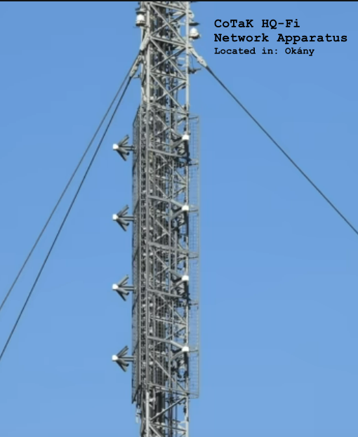

__CHAPTER 2: A NEW WAY OF LIFE__

Priskin was working in his out of school time on setting up new kind of communications infrastructure for a new, still unknown company, CoTaK Enterprises that wants to revolutionize mobile networks. He was finished with setting up the local antennas, and moved on to install the last remaining ones in Okány, before they would all be switched on.

Priskin drove on to Okány, and installed the two standard panel antennas on the top of the town house. There were 4 reserve arrays protruding from the each side of the panel antennas, visibly tuned to frequencies that are still unknown to everyone but few, though not for long.



The only thing that was left to do was for Priskin to turn on the entire system through his handheld terminal. He logged in.

 ```
PriskinOS p-pad 8.19.0-2-ppchip #1 SMP PREEMPT_DYNAMIC PPOS 8.19.11-1 (2028-10-24) xPPCH
No new messages.

pp@p-pad#~ > ssh -8 -o EncryptedPreAuthProcess=true -o Ciphers=cotak8128-cbedc -o RequireDeviceBased2FA=true -o SupplyPreAuthCredentials=true HandOverLocalDeviceControl=true pp@internal.cotak
cotak-sshd> Starting pre-authentication. sending local device control payload.
cotak-sshd> Payload accepted, waiting for pre-auth key delivery.
cotak-sshd> Pre-auth keys accepted, confidentality has been ensured for further steps. Please wait until retinal scan starts.
cotak-sshd> Retinal scan accepted and corresponds to the on-server version. Allowing further checks to proceed.
cotak-sshd> Please scan your fingers using the fingerprint sensor in the following order: left-ring-finger, left-left-index finger, left-thumb, right-right-finger, right-index-finger, right-thumb
cotak-sshd> Waiting for fingerprinting process completion...
cotak-sshd> Fingerprint has been accepted. Allowing further checks to proceed.
cotak-sshd> Please say the #1-53 identification password to the microphone using voice tone #3
cotak-sshd> Voice check within acceptable limits. Allowing further checks to proceed.
cotak-sshd> Please type in the master password to continue: *************************************************
cotak-sshd> All values accepted, logged in.
----------------------------------------------
  /WELCOME USER PRISKIN TO COTAK ENTERPRISES\

THIS SYSTEM IS THE PROPERTY OF COTAK ENTERPRISES,
ANY KIND OF INTERFERENCE WITH INTERNAL PROCESSES
IS PROHIBITED. PLEASE REFRAIN FROM ANY UNAUTHORIZED
MODIFICATIONS.
----------------------------------------------

i> NUMBER OF OPERATING SATELLITES: 51
i> NUMBER OF OPERATING TELECOM ANTENNAS: 0 (395 INSTALLED BUT NON-FUNCTIONAL)
i> ERRORS REPORTED: 0

pp@internal.cotak> network-remote-enable --all -l 1
!> WARNING: YOU ARE ABOUT TO ENABLE ALL TELECOM ANTENNAS OF COTAK ENTERPRISES
!> PREPARE TO MOVE A SAFE DISTANCE AWAY FROM ANY OPERATING EQUIPMENT
cotak-auth> Please enter the master password: *************************************************
cotak-auth> Please enter the enablement password: ********************************************************************
COTAK-SYSTEM> STARTING OVERRIDE CODE SYS-31B. ENABLING ALL TELECOM SATELLITES IN 3.... 2.... 1....
COTAK-SYSTEM> TELECOM SYSTEMS ENABLED, BOOTING PROCESS WILL FINISH IN 10 SECONDS. STAY AWAY FROM ANY EQUIPMENT
 ```
 
 Priskin didn't know what was about to happen, so he didn't stay back.
 
 In 10 seconds all the equipment started to light up, and a strange flare erupted from the main control box, going towards Priskin.
 
 Priskin blacked out, only to wake up hours later in a brand new world never seen before.
 
 [CHAPTER 3](chapter3.md)
